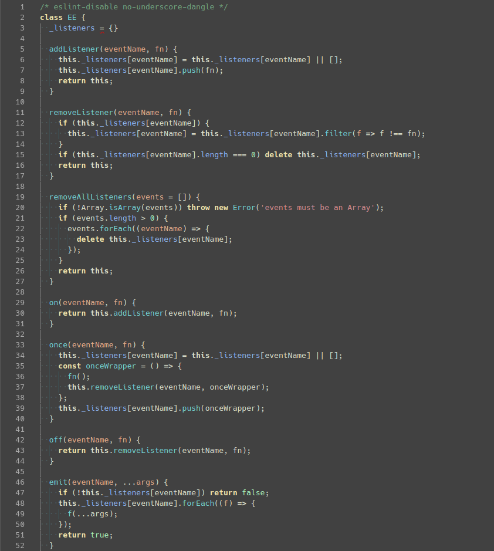

# Zenburn+

A theme extension for [Visual Studio Code](https://code.visualstudio.com) based on **Zenburn for Emacs** theme from [zenburn-emacs](https://github.com/bbatsov/zenburn-emacs)

---

## Supported syntax for:

- JavaScript
- JSON

## Planned syntax for:

- TypeScript
- HTML
- CSS
- GraphQL
- YML
- .env

## Customizing

- If you want to customize on top of this theme, use vscode's [color customization](https://code.visualstudio.com/docs/getstarted/themes#_customizing-a-color-theme) feature

## Screenshot

## Changelog

See [CHANGELOG.md](https://github.com/igolskyi/vscode-zenburn-plus-theme/master/./CHANGELOG.md)

**Enjoy!**
