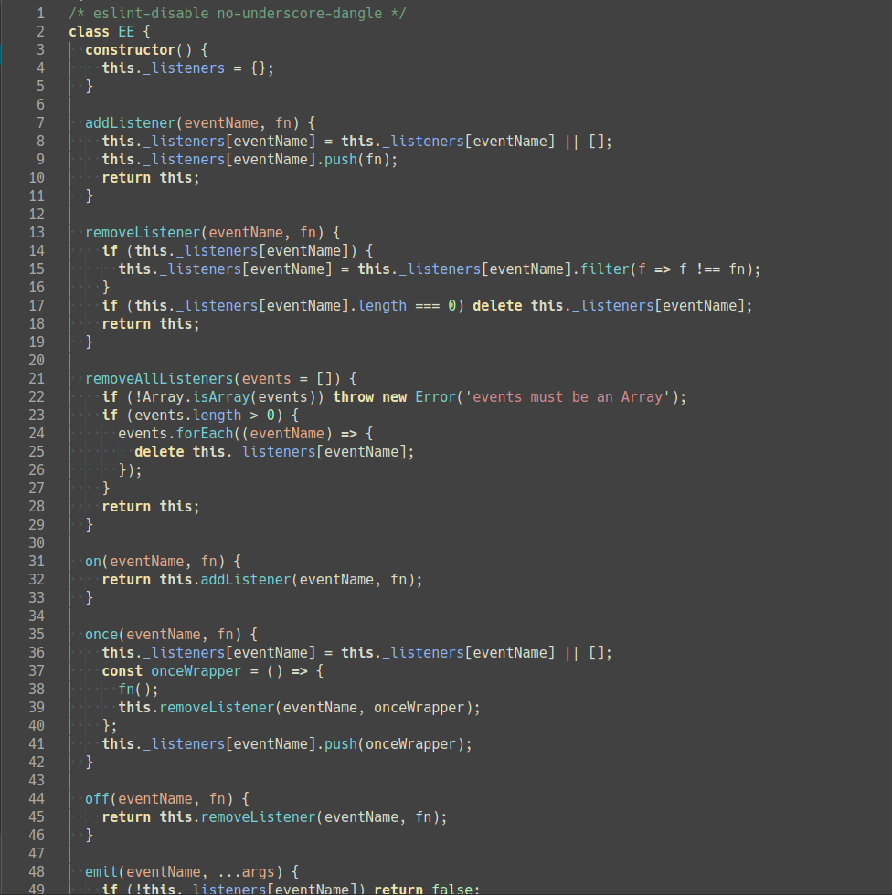
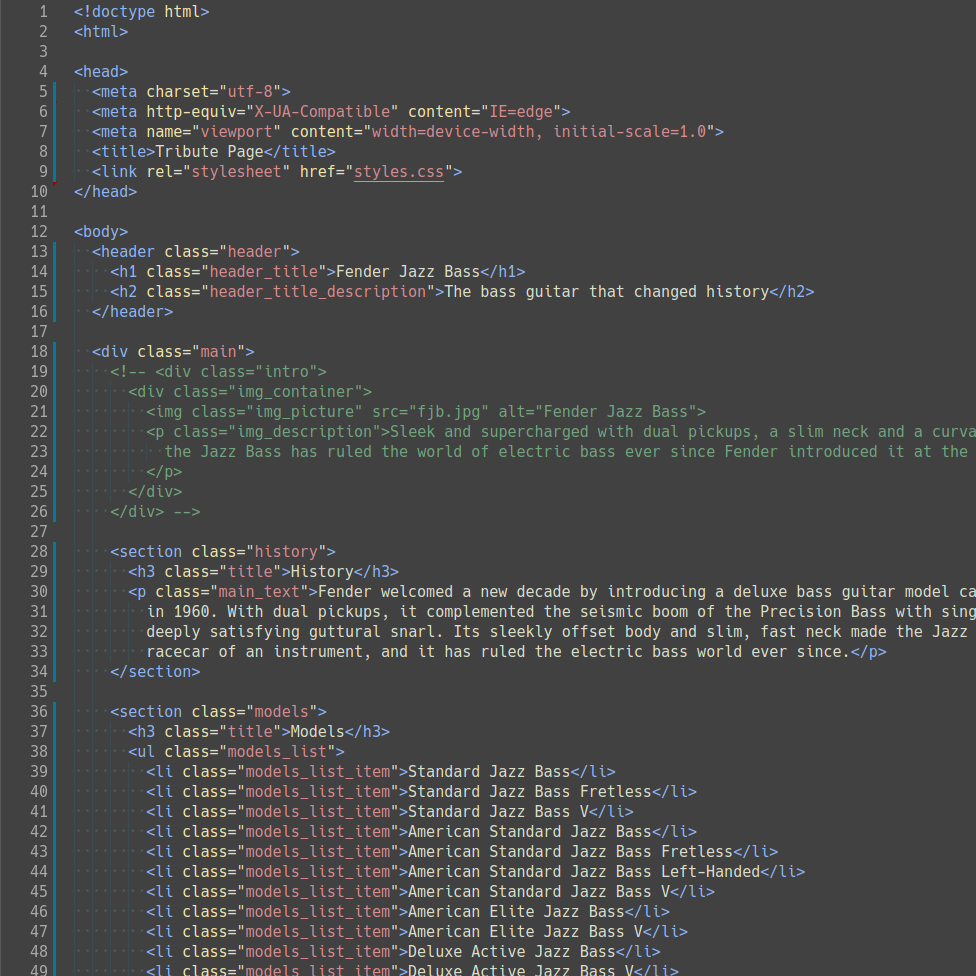

# Zenburn+

A theme extension for [Visual Studio Code](https://code.visualstudio.com) based on **Zenburn for Emacs** theme from [zenburn-emacs](https://github.com/bbatsov/zenburn-emacs)

---

Supported syntax for:

- JavaScript
- JSON
- Markdown
- HTML
- CSS, SCSS, Styl
- GraphQL
- YML
- VTL
- .env

## Customizing

- If you want to customize on top of this theme, use vscode's [color customization](https://code.visualstudio.com/docs/getstarted/themes#_customizing-a-color-theme) feature

## Screenshots

### JavaScript

### JSON

### Markdown

### HTML

### CSS

### GraphQL

### VTL

## Changelog

See [CHANGELOG.md](CHANGELOG.md)

**Enjoy!**
